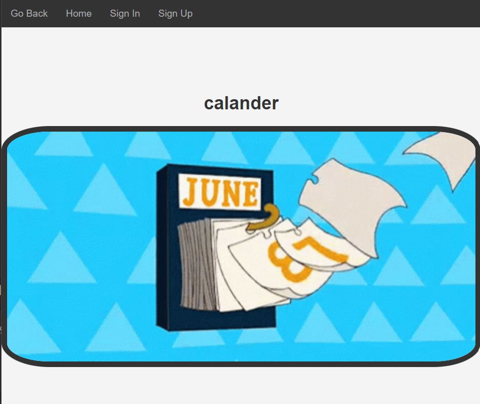
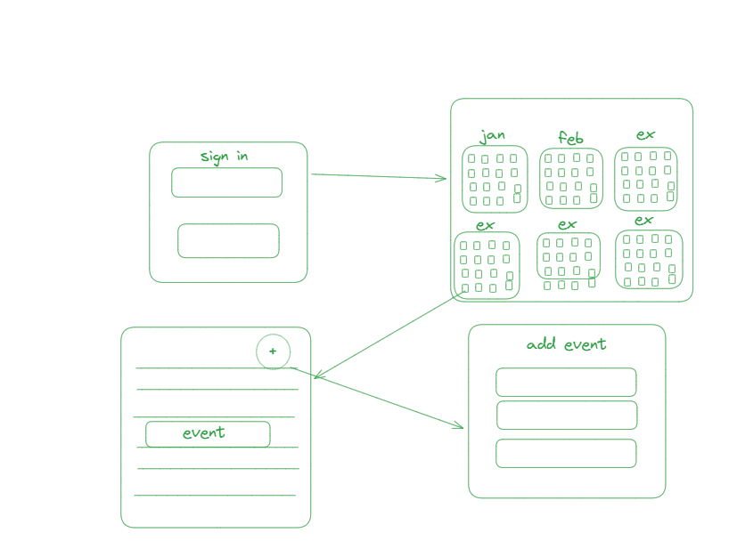
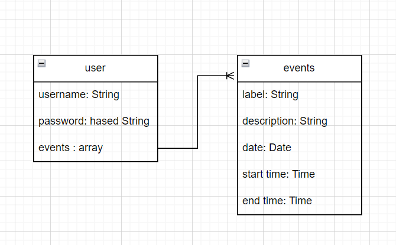

# calander



## overview


calander app is a way to track events on a user interface that mimics a calander user can sign in/up and add, update, delete events

## user stories


As a user, I want to create an account so that I can securely log in and access my personal calendar.

As a user, I want to sign in to my account so that I can access my personal calendar and manage events.

As a user, I want to select a specific year in the calendar so that I can view or manage events for that year.

As a user, I want to select a specific month in the calendar so that I can view or manage events for that month.

As a user, I want to select a specific day in the calendar so that I can view or manage events for that day.

As a user, I want to add an event to a specific day in the calendar so that I can keep track of important activities or appointments.

As a user, I want to edit an existing event in the calendar so that I can update its details if there are any changes.

As a user, I want to delete an existing event from the calendar so that I can remove activities or appointments that are no longer needed.


## sudocode

```
Start Express application
Define router and required modules

// Route for handling year selection and displaying calendar for the year
Define route POST /year
  Get year from request body or default to 2024
  Retrieve current user by session ID
  Fetch user's events from the database
  Render 'year' view with calendar, months, year, user ID, and events

// Route for displaying calendar for the year (GET)
Define route GET /year
  Get year from request body or default to 2024
  Retrieve current user by session ID
  Fetch user's events from the database
  Render 'year' view with calendar, months, year, user ID, and events

// Route for displaying events for a specific day
Define route GET /:year/:month/:day
  Retrieve current user by session ID
  Fetch user's events for the specific day
  Render 'day' view with year, month, day, events, and time list

// Route for rendering event creation page
Define route GET /:year/:month/:day/event
  Render 'event' view with year, month, and day

// Route for handling event creation form submission
Define route POST /:year/:month/:day/event
  Try to:
    - Retrieve current user by session ID
    - Add new event details to user's events
    - Save user to the database
    - Redirect to the year view
  Catch errors:
    - Log the error
    - Redirect to 404 page

// Route for handling event editing form submission
Define route PUT /:year/:month/:day/:event
  Try to:
    - Retrieve current user by session ID
    - Find specific event by ID in user's events
    - Update event details
    - Save user to the database
    - Redirect to the year view
  Catch errors:
    - Log the error
    - Redirect to home page

// Route for rendering event editing page
Define route GET /:year/:month/:day/:event
  Retrieve current user by session ID
  Find specific event by ID in user's events
  Render 'edit' view with event details

// Route for handling event deletion
Define route DELETE /:year/:month/:day/:event
  Try to:
    - Retrieve current user by session ID
    - Find specific event by ID in user's events
    - Delete event from user's events
    - Save user to the database
    - Redirect to the year view
  Catch errors:
    - Log the error
    - Redirect to home page

Export router
```

## plan



## ERD



## technologies used

1. ejs
2. javascript
3. HTML
4. CSS 
